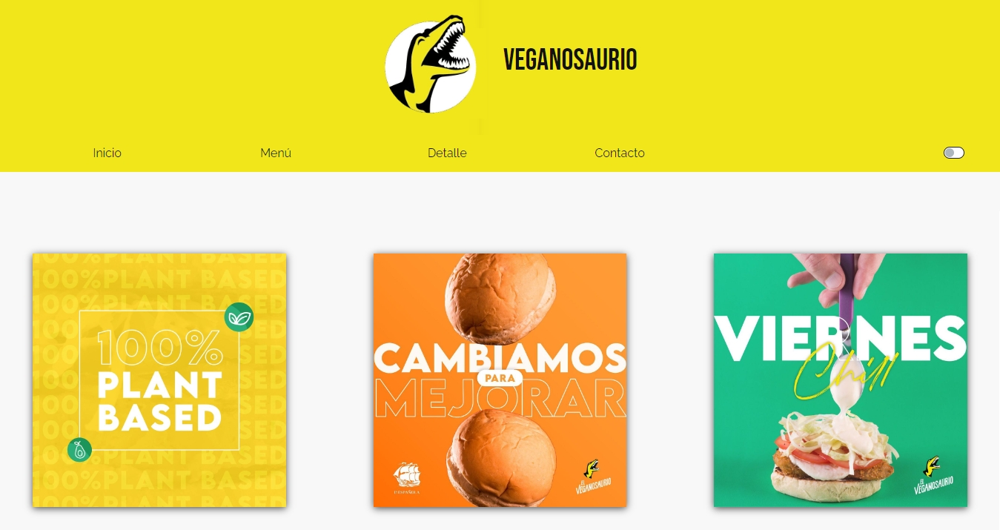
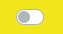
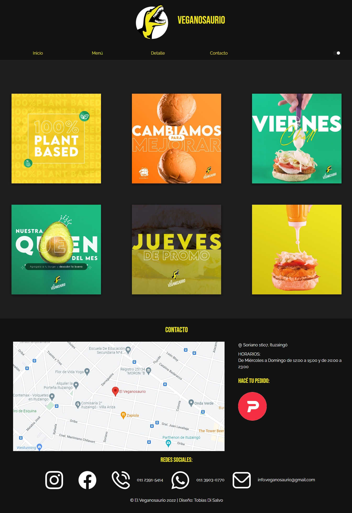
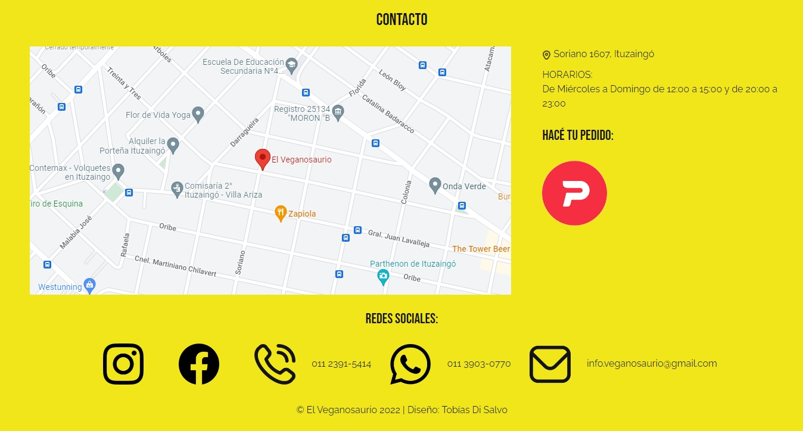
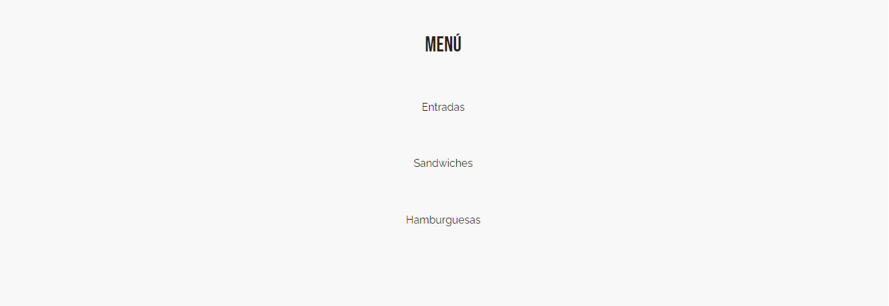
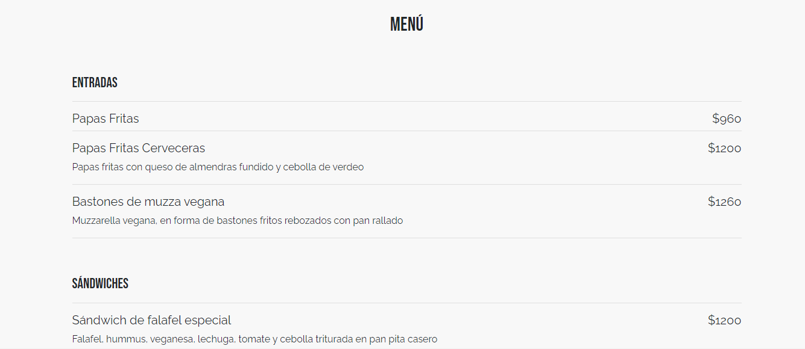
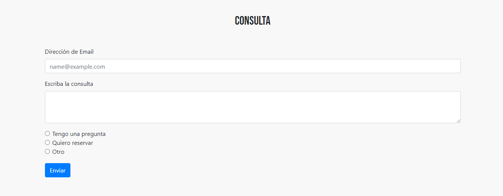

# Parcial I
## Diseño de interfaces de usuario
###### Di Salvo, Tobías

## Introducción

A lo largo de este documento, exploraremos la nueva WebApp para restaurantes, y así ofrecer el menú del mismo en línea. Esto es, en sí, una estructura general que puede ser personalizada para cada cliente en particular.

Para este trabajo decidí tomar referencia de un restaurante existente: el Veganosaurio.
Me parecía importante que se vea reflejada cómo sería su funcionalidad real. Por eso, incluí platos ofrecidos por el mismo restaurante, y me inspiré de sus redes sociales para buscar el enfoque estético de mi página. Tienen un diseño minimalista y moderno, por lo que me limité a usar solo tipografías de ese estilo y no sobre saturar la página de elementos.

## Página principal

La página principal será nuestra primera interacción con el restaurante. Aquí podremos ofrecer múltiples opciones. En este caso, dejamos una serie de imágenes que se irán actualizando a medida que fuera necesario.

En el header podemos encontrar una barra de navegación que nos permitira navegar por toda nuestra página web, contando con los vínculos correspondientes.

Además, a la derecha encontramos el botón para intercambiar entre modo oscuro y claro, para que los usuarios utilicen la paleta de colores que les haga sentir más cómodos.

Por último, debajo tenemos el footer, que cuenta con un mapa al local, un link directo a la aplicación de pedidos y links directos las redes sociales del local, como así información de contacto como el teléfono o el correo.

## Menú

En la sección "Menú" contamos con un link directo a las secciones que más nos interesen de la carta. De esta manera logramos que el usuario se haga una idea general de los platos ofrecidos, y una vez decidido puede dirigirse directamente a esa sección de la carta. Pero, si igual no está conforme con su decisión, puede seguir mirando el resto de opciones, ya que se lo dirige a la carta completa y no solamente a la sección elegida.

## Carta

En la sección "Detalle" contamos con toda la información de la carta completa. En ella se encuentran todos nuestros platos volcados con la información necesaria y su precio. Así conseguimos que el usuario pueda fijarse por su propia cuenta los platos ofrecidos y sus precios, y no deba hacer preguntas directas al local o encontrarse con una sorpresa una vez ya en el restaurante.

## Contacto

En la sección "Contacto" contamos con un formulario muy simple para que los clientes puedan comunicarse con el restaurante de forma sencilla. Con solo colocar su dirección de e-mail, su consulta y el asunto por el cual se comunican, es muy fácil para los clientes hacer preguntas o reservar un lugar. Además, el mail vendrá ya ordenado dependiendo del tipo de consulta, por lo que al local le será fácil determinar la prioridad de los mails a responder.

## Conclusión

De esta forma logramos que el usuario consiga una experiencia clara, sencilla y eficaz a la hora de conseguir la información necesaria para consumir nuestros productos. En caso de necesitar información la tienen ahí mismo en la página web, si quieren reservar pueden hacerlo de forma sencilla y si, por el contrario, prefieren un envío a domicilio cuentan con el link directo a la plataforma de pedidos. Por lo tanto mejoramos ampliamente la experiencia del usuario y el trabajo requerido para estas tareas, que antes debían ser todas realizadas por una persona.